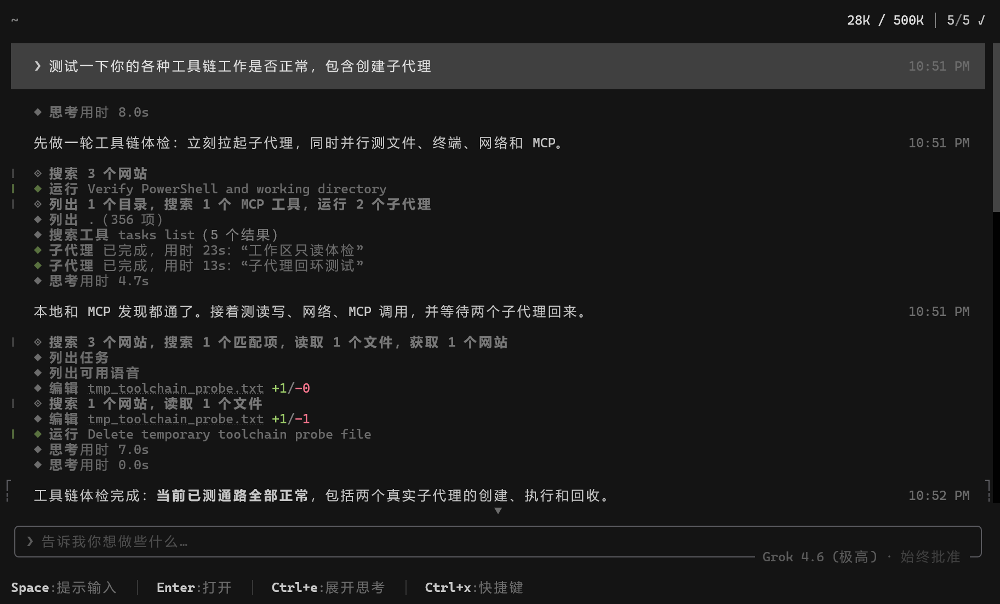
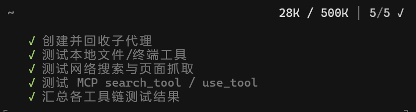

<div align="center">

<h1>
  <picture>
    <source media="(prefers-color-scheme: dark)" srcset="https://media.x.ai/v1/website/spacexai-symbol-white-transparent-0c31957f.png">
    <source media="(prefers-color-scheme: light)" srcset="https://media.x.ai/v1/website/spacexai-symbol-black-transparent-6435cf42.png">
    
  </picture>
  <br>
  Grok Build 简体中文社区版（<code>grok-zh</code>）
</h1>

这是基于官方 [xai-org/grok-build](https://github.com/xai-org/grok-build) Fork 的非官方简体中文社区版。

本项目在尽量保持原有功能、命令行参数、配置格式和协议兼容性的前提下，为 Grok Build 的 CLI、TUI、设置、提示信息和用户文档提供简体中文支持。它以独立程序名 `grok-zh` 与官方版并行使用，但有意共用 `~/.grok` 数据目录：会话、登录状态、配置、第三方 API、插件与本地状态在两个入口之间保持一致。

[项目定位](#项目定位) · [当前状态](#当前状态) · [Windows-安装](#windows-安装) · [从源码构建](#从源码构建) · [共享数据与兼容约定](#共享数据与兼容约定) · [文档](#文档) · [开发](#开发) · [Releases](https://github.com/JoyElliot/grok-build-Chinese/releases) · [上游与发布策略](#上游与发布策略) · [许可证](#许可证)



</div>

---

## 项目定位

- 官方 Grok Build 的产品介绍与服务说明见 [x.ai/cli](https://x.ai/cli)。
- 本仓库不是 SpaceXAI 官方发行版，也不代表官方翻译或服务承诺。
- `SOURCE_REV` 记录本仓库源码所对应的官方 monorepo 提交；发布时还会记录 Fork 的 Git 提交和工作树状态。
- 模型可用性、账号权限、订阅、远程会话、搜索、语音及其他在线能力依赖官方服务端，社区 Fork 无法保证。

## 当前状态

当前稳定版为 `v1.0.5`，提供 Windows x86_64 GNU 完整 ZIP。Windows 产物尚未经过 Authenticode 签名，首次运行可能触发 SmartScreen；请只从本仓库 [Releases](https://github.com/JoyElliot/grok-build-Chinese/releases) 下载。

`zh-dev` 另提供由 GitHub 托管 Apple Silicon runner 构建的 macOS ARM64
[预览 Artifact](https://github.com/JoyElliot/grok-build-Chinese/actions/workflows/build-macos-arm.yml)。
该产物只用于构建与真实设备测试，尚未使用 Apple Developer ID 签名或公证，也不会独立
创建 Release；安装和安全边界见 [macOS ARM64 预览说明](packaging/macos/INSTALL-MACOS.md)。

已建立的产品与数据边界：

- 可执行文件：`grok-zh.exe`
- 与官方版共用的默认数据目录：`~/.grok`
- 两个程序共同使用的目录覆盖：`GROK_HOME`
- 默认界面语言：`zh-CN`，可用 `--locale en-US` 切换英文
- 内置更新器只读取本仓库的 Immutable GitHub Releases；官方 npm、GitHub、x.ai 和 GCS 更新源始终禁用

### 中文标题与计划

官方原版的相关提示没有中文语言约束，中文对话中的会话标题和计划容易被生成为英文。社区版没有重写整套上游提示词，只在会话标题和主要计划入口加入少量、按条件生效的语言规则：中文请求优先生成简洁的中文标题，并以简体中文创建计划和任务步骤；命令、路径、工具名、配置键、协议字段、任务 ID 以及 `pending`、`in_progress`、`completed`、`cancelled` 等规范状态仍保持原样。标题为空或中文请求生成纯英文标题时，会回退到用户输入。



> [!WARNING]
> `crates/codegen/xai-grok-pager/scripts/` 下的安装脚本及同模块内的 npm 包装仍来自官方上游，可能安装或覆盖官方 `grok`。安装社区版时只使用本仓库 Releases 中的完整 ZIP。

## Windows 安装

正式 Tag 工作流会在 [Releases](https://github.com/JoyElliot/grok-build-Chinese/releases)
中发布完整 Windows ZIP；`CI` 工作流仍会上传短期 Actions Artifact。
解压完整包后，直接双击包根目录中的：

```text
一键安装.cmd
```

安装窗口会显示完整性校验和文件复制进度，完成后提示在新终端中输入
`grok-zh` 或 `agent-zh`。默认安装与官方命令共存；如需直接使用 `grok`、`agent`
启动中文版，再双击 `[可选]替换原始启动方式.cmd`，并在菜单中选择是否保留官方
程序入口。该可选操作不会删除共享的聊天记录、登录状态或配置。高级参数、恢复方式
和共享数据边界见 [Windows 自动安装说明](packaging/windows/INSTALL-WINDOWS.md)。

### 自动更新

- 默认使用 `stable` 通道，只接受本仓库非 Draft、非 prerelease 的 Immutable Release；如需预览版，可显式运行 `grok-zh update --alpha`。
- 更新器只接受完整 ZIP 及其 `.sha256`，并校验下载地址、大小、SHA-256、ZIP 布局、包内 `SHA256SUMS.txt` 和候选程序版本。
- 后台自动更新默认关闭。按 `Ctrl+U` 才会下载并安装本次更新；也可以在设置中显式开启后台更新。
- 激活失败时保留当前版本；需要同步 `agent-zh.cmd`、`rg.exe`、安装器或文档时，重新运行新 ZIP 中的安装器。

旧版迁移、高级参数和恢复方式见 [Windows 自动安装说明](packaging/windows/INSTALL-WINDOWS.md)。正式 Release 同时提供 SHA-256 与 GitHub Artifact Attestation，用于核对文件完整性和云端构建来源；它们不等同于 Windows Authenticode 签名。

### 反馈

- 当遇到汉化不全等任何问题时，欢迎提出 [issue](https://github.com/JoyElliot/grok-build-Chinese/issues)
- Linux Do 社区讨论地址：[点此进入](https://linux.do/t/topic/2770188)

## 从源码构建

### 通用要求

- Rust：版本由 `rust-toolchain.toml` 固定。
- [DotSlash](https://dotslash-cli.com)：用于下载并运行 `bin/` 下的密封工具，尤其是 `bin/protoc`。构建前请确保 `dotslash` 已加入 `PATH`：

  ```sh
  cargo install dotslash
  # 或使用预编译软件包：https://dotslash-cli.com/docs/installation/
  dotslash --help
  ```

- `protoc`：构建脚本优先通过 DotSlash 解析仓库内的 `bin/protoc`，也会回退到 `PATH` 或 `PROTOC` 指定的程序。
- 官方仓库主要支持 macOS 与 Linux；本 Fork 另行建设 Windows 构建和验证流程。

常用检查：

```sh
cargo run -p xai-grok-pager-bin
cargo build --locked -p xai-grok-pager-bin --release
cargo check --locked -p xai-grok-pager-bin --bin grok-zh --features release-dist
cargo test --locked -p xai-grok-locale
cargo fmt --all --check
```

普通 release 构建的产物为 `target/release/grok-zh`（Windows 为 `grok-zh.exe`）。首次启动会打开浏览器完成身份验证；详见[身份验证指南](crates/codegen/xai-grok-pager/docs/user-guide/zh-CN/02-authentication.md)。

### Windows 绿色测试构建

下面的命令把 Cargo 缓存、构建输出和测试数据放在仓库忽略的
`.codex-local` 目录中。它仅用于本地开发测试，不属于正式安装器。

```powershell
$localRoot = Join-Path $PWD '.codex-local'
$env:CARGO_HOME = Join-Path $localRoot 'cargo-home'
$env:CARGO_TARGET_DIR = Join-Path $localRoot 'target'
$env:GROK_HOME = Join-Path $localRoot 'test-home'
$env:GROK_VERSION = "1.0.3-zh.preview.1"
cargo build --frozen --target x86_64-pc-windows-gnu `
  -p xai-grok-pager-bin --profile release-dist --features release-dist
```

预期产物：

```text
.codex-local/target/x86_64-pc-windows-gnu/release-dist/grok-zh.exe
```

绿色测试包还会在 `grok-zh.exe` 同目录携带 `rg.exe`。社区版搜索入口优先使用该旁载工具，缺失时再回退到系统 `PATH`；这只隔离程序安装文件，不改变两个程序共用 `~/.grok` 数据的约定。

正式 Windows 发布仍需补齐 MSVC 构建、代码签名、安装包和 DLL 闭包验证；社区自动更新链
已经接入本仓库 Releases，并只消费经过双层校验的 Windows GNU 完整 ZIP。

## 共享数据与兼容约定

`grok` 与 `grok-zh` 直接读写同一个 `~/.grok`（或 `GROK_HOME`）目录，不使用复制或双向同步层。因此在任一入口创建、恢复、重命名或删除会话，登录或退出账号，修改模型、第三方 API、MCP、插件和用户配置，另一入口都会看到相同结果。若两个程序同时运行，它们也遵循上游已有的文件锁与并发规则。

以下名称必须保持稳定，不做翻译：

- CLI 子命令、参数与取值，例如 `agent`、`--resume`、`--output-format json`
- 配置键、环境变量和序列化字段，例如 `[ui] screen_mode`、`GROK_HOME`、JSON key
- MCP、ACP、OAuth、OIDC、OSC 52 等协议名
- 工具名、模型 ID、会话 ID、路径、URL、日志字段和服务端原始错误

协议身份、遥测字段或兼容性所需的内部 `grok-pager` 名称可能继续保留；中文版的程序名使用 `grok-zh`，用户数据路径与官方版共同使用 `.grok`。

## 文档

- Windows 自动安装：[`packaging/windows/INSTALL-WINDOWS.md`](packaging/windows/INSTALL-WINDOWS.md)
- macOS ARM64 预览：[`packaging/macos/INSTALL-MACOS.md`](packaging/macos/INSTALL-MACOS.md)
- 中文用户指南：[`crates/codegen/xai-grok-pager/docs/user-guide/zh-CN/README.md`](crates/codegen/xai-grok-pager/docs/user-guide/zh-CN/README.md)
- 中文入门教程：[`crates/codegen/xai-grok-pager/docs/tutorial/zh-CN/`](crates/codegen/xai-grok-pager/docs/tutorial/zh-CN/)
- 英文上游用户指南：[`crates/codegen/xai-grok-pager/docs/user-guide/README.md`](crates/codegen/xai-grok-pager/docs/user-guide/README.md)
- 贡献说明：[`CONTRIBUTING.zh-CN.md`](CONTRIBUTING.zh-CN.md)
- 安全策略：[`SECURITY.zh-CN.md`](SECURITY.zh-CN.md)
- 1.0.6 简体中文更新说明：[`crates/codegen/xai-grok-shell/changelogs/1.0.6.zh-CN.md`](crates/codegen/xai-grok-shell/changelogs/1.0.6.zh-CN.md)
- 1.0.5 简体中文更新说明：[`crates/codegen/xai-grok-shell/changelogs/1.0.5.zh-CN.md`](crates/codegen/xai-grok-shell/changelogs/1.0.5.zh-CN.md)
- 1.0.3 简体中文发行说明：[`crates/codegen/xai-grok-shell/changelogs/1.0.3.zh-CN.md`](crates/codegen/xai-grok-shell/changelogs/1.0.3.zh-CN.md)
- 版本发布：[`Releases`](https://github.com/JoyElliot/grok-build-Chinese/releases)
- 官方在线文档：[docs.x.ai/build/overview](https://docs.x.ai/build/overview)

中文文档将使用稳定文档 ID 和 `zh-CN` 平行目录，不直接改变英文标题所承担的查找身份，以降低合并上游更新时的冲突。

## 仓库结构

| 路径 | 内容 |
|---|---|
| `crates/codegen/xai-grok-locale` | 集中式语言目录、locale 解析与回退 |
| `crates/codegen/xai-grok-product` | 社区版程序名、共享数据目录与更新安全策略 |
| `crates/codegen/xai-grok-pager-bin` | 组合入口，生成 `grok-zh` |
| `crates/codegen/xai-grok-pager` | TUI、回滚区、提示输入、模态框和渲染 |
| `crates/codegen/xai-grok-shell` | 智能体运行时及 leader/stdio/headless 入口 |
| `crates/codegen/xai-grok-tools` | 终端、文件编辑、搜索等工具实现 |
| `crates/codegen/xai-grok-workspace` | 文件系统、版本控制、执行和检查点 |
| `crates/codegen/...` | CLI 依赖闭包中的其他配置、MCP、Markdown、沙箱等 crate |
| `crates/common/`、`crates/build/`、`prod/mc/` | 依赖闭包中少量共享与构建辅助 crate |
| `third_party/` | 仓库内 vendored 的 Mermaid 相关源码；归属见其中的 `NOTICE` |

> [!IMPORTANT]
> 根 `Cargo.toml`（工作区成员、依赖版本、lint 和 profile）由上游生成，应视为只读。新增社区功能应优先放在独立 crate 或局部适配层中，避免对上游文件进行大范围结构改写。

## 开发

工作区很大，日常检查应优先指定具体 crate：

```sh
cargo check -p <crate>
cargo test -p xai-grok-config
cargo clippy -p <crate>
cargo fmt --all
```

上游仓库不接受外部拉取请求；本社区 Fork 尚未公布独立贡献流程。开始修改前请先阅读[中文贡献说明](CONTRIBUTING.zh-CN.md)，并通过本仓库 Issue 与维护者沟通。

## 上游与发布策略

- `main`：尽量保持官方上游镜像，只用于同步和审查。
- `zh-dev`：汉化开发、上游合并、构建和测试。
- 计划中的 `zh-stable`：只有在中文验证通过后才建立；稳定 Release 只由指向已审核提交的
  严格三段 Tag `vA.B.C` 触发，并与上游包版本保持一致。
- 上游 `main` 更新只能触发审查和测试，不能直接进入用户更新源。
- GitHub 发布页正文统一使用中文；每条提交名称链接到对应的 GitHub 提交页面。若提交标题
  不是中文，必须先在 `.github/release-notes/commit-titles.zh-CN.json` 中按完整 SHA 提供
  可审查的中文标题，否则发布会在构建前失败。
- 合并上游的提交必须在同一映射文件中登记已审核的父提交与合并基线；生成器核对 Git
  提交图后，生成独立的“上游更新”区块，列出上游比较范围和实际同步的上游提交链接。
- 正式更新日志、协议兼容检查、本 Fork 的 Windows 测试结果、Immutable Releases 开关和
  精确资产摘要共同构成发布门槛；官方 stable 指针不参与社区更新。

## 贡献

本项目当前处于社区维护准备阶段。提交翻译时请保留命令、配置键、协议字段、代码块、占位符和 URL，并优先修改集中式 locale 目录；不要在业务代码中逐处硬编码中文。

上游仓库的外部贡献政策见 [`CONTRIBUTING.md`](CONTRIBUTING.md)。

## 许可证

本仓库第一方代码采用 **Apache License, Version 2.0**，详见 [`LICENSE`](LICENSE)。本 Fork 的修改继续遵守相同许可证，并保留上游版权和归属说明。

第三方及 vendored 代码保持各自原许可证，详见：

- [`THIRD-PARTY-NOTICES`](THIRD-PARTY-NOTICES)
- [`crates/codegen/xai-grok-tools/THIRD_PARTY_NOTICES.md`](crates/codegen/xai-grok-tools/THIRD_PARTY_NOTICES.md)
- [`third_party/NOTICE`](third_party/NOTICE)
